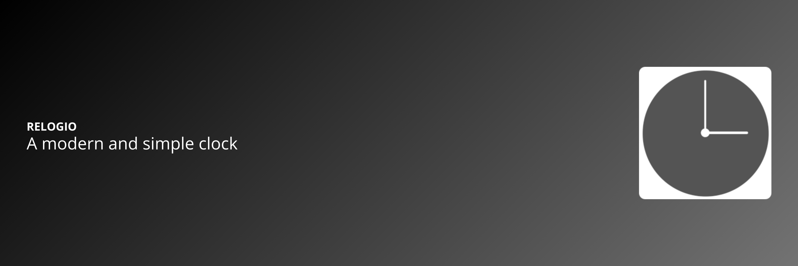
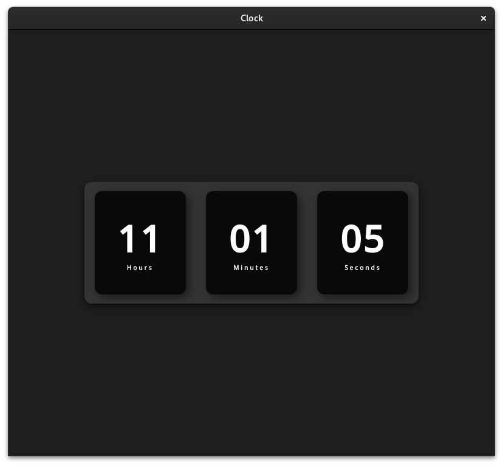

<h1 align="center"> Relogio Desktop </h1>

A modern and simple clock for desktop linux made with electron JS

  <a href="#-technologies">Technologies</a>&nbsp;&nbsp;&nbsp;|&nbsp;&nbsp;&nbsp;
  <a href="#-project">Project</a>&nbsp;&nbsp;&nbsp;|&nbsp;&nbsp;&nbsp;
  <a href="#-download">Download</a>&nbsp;&nbsp;&nbsp;|&nbsp;&nbsp;&nbsp;
  <a href="#memo-License">License</a>

  

  

  

## 🚀 Technologies

This project made with:

- JavaScript
- Electron JS
- HTML e CSS
- Git e Github

## 💻 Project
View the time elegantly on your Linux computer with our app!

## 🌐 Download

Donwload for: <a href="https://snapcraft.io/relogio">Snap Store</a>

<code>$ sudo snap install relogio</code>

## :memo: License
This project is under the GNU license.

---
Made with ♥ by Érick